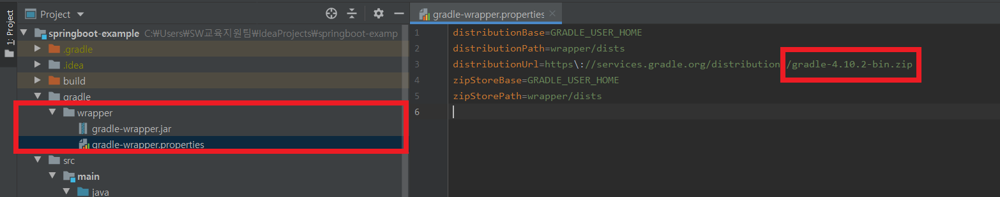

# 교재 프로젝트 환경 점검

* Java 8
* Gradle 4.x
* Spring Boot 2.1.x

스프링 프로젝트를 자동으로 만들어주는 [spring.io](https://spring.io) 의 기본 환경인 **Spring Boot 2.2.x**와 **Gradle 5.x** 환경에서 **정상 작동하지 않는다.**

Gradle과 Spring Boot의 버전 점검은 다음과 같다.

## 1. Gradle 버전 체크

현재 프로젝트의 Gradle의 버전 체크는 여기서 한다.  
`gradle/wrapper/gradle-wrapper.properties` 설정 파일에서 어떤 gradle 버전을 웹 환경에서 다운로드 받을지 설정한다.



만약 `gradle-5.6.4-bin.zip` 과 같이 Gradle 5.x를 사용 중이라면 버전을 변경해야 한다. 인텔리제이에서 `Alt + F12`로 아래 터미널창을 열어 다음 명령어를 실행한다.

```
gradlew wrapper --gradle-version 4.10.2
```

## 2. Spring Boot 버전 체크

`build.gradle` 설정 파일에서 다음과 같이 스프링 부트 버전을 지정할 수 있다. 이 때, 2.1.x 버전인지 확인해야 한다.

```
buildscript {
    ext {
        springBootVersion = '2.1.7.RELEASE' // 2.1.7, 2.1.8, 2.1.9 모두 정상작동한다.
    }
    repositories {
        mavenCentral()
        jcenter()
    }
    dependencies {
        classpath("org.springframework.boot:spring-boot-gradle-plugin:${springBootVersion}")
    }
}
```

스프링 부트 이니셜라이저로 만든 2.2.x 버전인 경우 아래와 같이 설정 돼있습니다.

```
plugins {
    id 'org.springframework.boot' version '2.2.1.RELEASE'
    ...
}
```

## 출처

[스프링 부트와 AWS로 혼자 구현하는 웹 서비스 README.md](https://github.com/jojoldu/freelec-springboot2-webservice#%ED%94%84%EB%A1%9C%EC%A0%9D%ED%8A%B8-%ED%99%98%EA%B2%BD-%EC%A0%90%EA%B2%80)