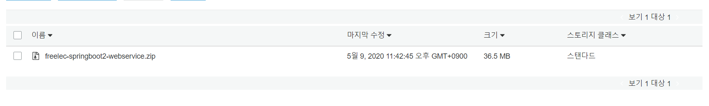

# Travis CI 배포 자동화

## S3 버킷 생성

AWS의 S3 서비스는 일종의 파일 서버다. 순수하게 파일들을 저장하고 접근 권한을 관리, 검색 등을 지원하는 파일 서버다. S3는 보통 게시글에 첨부하는 첨부파일 등록을 구현할 때 많이 이용한다. Travis CI에서 생성된 Build 파일을 저장하도록 구성할 것이다. S3에 저장된 Build 파일은 이후 AWS의 CodeDeploy에서 배포할 파일로 가져가도록 구성할 예정이다.

S3 버킷명은 배포할 Zip 파일이 모여있는 장소임을 의미하도록 짓는 것을 추천한다. (ex. project-build) 버킷명은 다른 이름과 중복이 불가능하다.

S3 버킷을 생성하면 S3로 배포 파일을 전달할 준비가 모두 끝났다.

## .travis.yml 추가

```yml
before_deploy:
  - zip -r freelec-springboot2-webservice {프로젝트 이름}
  - mkdir -p deploy
  - mv freelec-springboot2-webservice.zip deploy/freelec-springboot2-webservice.zip

deploy:
  - provider: s3
    access_key_id: $AWS_ACCESS_KEY # Travis repo settings에 설정된 값
    secret_access_key: $AWS_SECRET_KEY # Travis repo settings에 설정된 값
    bucket: chipmunk-springboot-build
    region: ap-northeast-2
    skip_cleanup: true
    acl: private # zip 파일 접근을 private 으로
    local_dir: deploy # before_deploy에서 생성한 디렉토리
    wait-until-deployed: true
```

1. `before_deploy`
   1. deploy 명령어가 실행되기 전에 수행
   2. CodeDeploy는 Jar 파일은 인식하지 못하므로 Jar + 기타 설정 파일들을 모아 압축한다.
2. `zip -r freelec-springboot2-webservice`
   1. 현재 위치의 모든 파일을 `freelec-springboot2-webservice` 이름으로 압축한다.
   2. 명령어의 마지막 위치는 본인의 프로젝트 이름이어야 한다.
3. `mkdir -p deploy`
   1. deploy 라는 디렉토리를 Travis CI가 실행 중인 위치에서 생성한다.
4. `mv freelec-springboot2-webservice.zip deploy/freelec-springboot2-webservice.zip`
   1. `freelec-springboot2-webservice.zip` 파일을 `deploy/freelec-springboot2-webservice.zip` 으로 이동시킨다.
5. `deploy`
   1. S3로 파일 업로드 또는 CodeDeply로 배포 등 외부 서비스와 연동될 행위들을 선언
6. `local_dir:deploy`
   1. 앞에서 생성한 deploy 디렉토리를 지정한다.
   2. 해당 위치의 파일들만 S3로 전송한다.

마스터 브랜치로 푸시하면 Travis CI의 성공 결과 로그가 나타난다.

```
Installing deploy dependencies
Logging in with Access Key: ****************
Beginning upload of 1 files with 5 threads.
Preparing deploy
Deploying application
Done. Your build exited with 0.
```

S3 버킷에 가보면 업로드가 성공한 것을 확인할 수 있다.



## 참고 도서

스프링 부트와 혼자 구현하는 웹 서비스