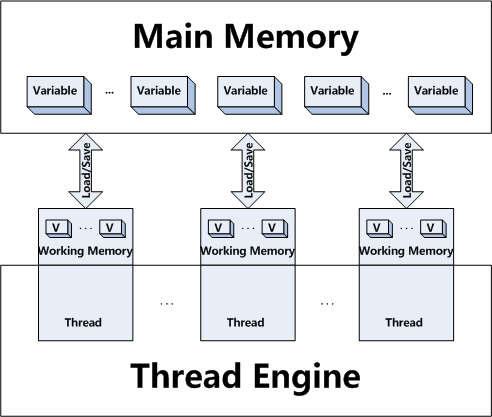

# 디자인패턴 - 싱글톤

## 목차

1. Eager Initialization (Early Loading)
2. Static Block Initialization
3. Lazy Initialization
4. Thread Safety
5. Double-Checked Locking
6. Bill Pugh Solution
7. Reflection 을 이용해 싱글톤 무력화시키기
8. Enum 싱글톤
9. 싱글톤과 직렬화
10. 싱글톤 패턴의 실제 사용 예

## 싱글톤 패턴

전체 애플리케이션 안에서 단 하나의 인스턴스만 생성되도록 강제하는 디자인 패턴이다. 인스턴스 생성은 외부에서 이루어져선 안된다. 접근 제어자를 통해 싱글톤 패턴으로 정의된 클래스 내부에서만 생성되어야 한다.

## 1. Eager Initialization (Early Loading)

`EagerSingle` 클래스가 로드될 때 `EagerSigleton` 인스턴스가 생성된다. 가장 간단한 방법이지만, 애플리케이션에서 한 번도 사용하지 않더라도 인스턴스는 항상 생성된다는 단점이 있다.

```java
public class EagerSingleton {
    private static EagerSingleton instance = new EagerSingleton();
    
    // private constructor
    private EagerSingleton() {
    }
    
    public static EagerSingleton getInstance() {
        return instance;
    }
}
```

static 초기화가 필요한 경우 클래스가 로드된다. 로드된 클래스는 계속해서 메모리에 남을 수 있다.

static 접근 제어자로 `EagerSingleton` 클래스는 항상 로드된다. `instance` static 변수에 `EagerSingleton` 인스턴스가 생성되어 할당한다.

위 코드 만으로 `EagerSingleton.getInstance()` 메소드를 호출하지 않는 경우 인스턴스가 생성되지 않는다. `EagerSingleton` 클래스에 `getInstance()` 메소드 하나만 존재하기 때문이다. `EagetSingleton` 클래스가 사용되는 경우 `getInstance()` 메소드 하나 밖에 없기에 `getInstance()` 호출 외에는 `EagerSingleton` 클래스가 사용될 수 없다. 사용되지 않는 클래스는 로드되지 않는다. 따라서 클래스가 로드되지 않으면 static 초기화도 진행되지 않는다.

만약 `EagerSingleton` 클래스에 다른 static 메소드가 존재하고, 이 다른 메소드가 `getInstance()` 메소드가 호출되기 전에 어딘가에서 호출된다면, `getInstance()`를 호출하지 않아도 `EagerSingleton` 인스턴스는 생성된다. 다른 static 메소드로 `EagerSingleton` 클래스가 로드되기 때문이다.

클래스 로딩을 확인하기 위해 static으로 선언된 임의의 메소드를 만든다. `main` 메소드에 `EagerSingleton.~~~()` 메소드를 호출한다. 이 때, `getInstance()` 메소드는 호출하지 않는다. JVM 옵션으로 `-verbose:class`를 입력하고 실행하면 로딩되는 클래스들을 모두 출력한다. `EagerSingleton` 클래스가 로딩되는 것을 확인할 수 있다.

```
[Loaded singleton.EagerSingleton from file:~]
```

## 2. Static Block Initialization

Eager Initialization과 유사하지만, 인스턴스가 static bloc 내에서 만들어지고 예외 처리까지 할 수 있다.

```java
public class StaticBlockSingleton {
    private static StaticBlockSingleton instance;
    private StaticBlockSingleton(){}
    
    //static block initialization for exception handling
    static{
        try{
            instance = new StaticBlockSingleton();
        }catch(Exception e){
            throw new RuntimeException("Exception occured in creating singleton instance");
        }
    }
    public static StaticBlockSingleton getInstance(){
        return instance;
    }
}
```

`new` 연산으로 새로운 메모리를 힙에 할당하지 못한다면 `OutOfMemoryError` 예외를 내려준다.

## 3. Lazy Initialization

Eager Initialization의 단점을 보완한다. 생성자는 역시 `private` 접근 제어자로 클래스 내부에서만 호출할 수 이싿. 객체 생성은 static 메소드인 `getInstance()` 메소드를 이용해야만 한다.

```java
public class LazyInitializedSingleton {
    private static LazyInitializedSingleton instance;
    
    private LazyInitializedSingleton() {}
    
    public static LazyInitializedSingleton getInstance(){
        if(Objects.isNull(instance)) {
            instance = new LazyInitializedSingleton();
        }
        return instance;
    }
}
```

`getInstance()` 메소드에서 변수 `instance`가 `null`인 경우에만 인스턴스를 새로 생성하므로 싱글톤 패턴에 해당된다. `getInstance()` 메소드를 호출 해야만 인스턴스가 생성 되기에 Eager Initialization의 단점을 보완했다.

그러나 새로운 문제점이 있는데 바로 쓰레드에 안전하지 않다. 멀티 쓰레드 환경에서 동시에 `getInstance()`를 호출하고 동시에 `instance` 변수의 `null` 값을 검사하는 상황이라면, 여러 개의 인스턴스가 생성되는 꼴이 된다.

## 4. Thread-Safe Singleton

`getInstance()` 메소드 정의에 `synchronized` 키워드를 붙이면 된다. `getInstance()` 메소드를 호출할 때 마다 다른 쓰레드는 접근할 수 없는 문제점이 있다. 메소드 호출 시 마다 Lock을 걸어 성능을 저하시키는 것이 아닌, 인스턴스를 하나만 생성되는 것이 목표다. 인스턴스를 생성하고 나서부터는 `synchronized` 키워드가 필요 없다.

## 5. Double-Checked Locking

`null` 검사를 `synchronized` 블록 밖에서 한 번, 안에서 한 번 해 **두 번** 검사한다. 밖에서 하는 검사는 이미 인스턴스가 생성된 경우 바로 인스턴스를 반환하는 목적이다. 안에서 하는 검사는 인스턴스가 생성되지 않은 경우 단 한개의 인스턴스만 생성되도록 보장하기 위함이다. 안 쪽 검사가 없다면 여러 쓰레드가 순서대로 인스턴스를 생성해버린다. 따라서 안 쪽에도 검사를 해 첫 번째 생성 이후 다음 쓰레드부터는 생성을 하지 못하도록 한다.

```java
public class DoubleCheckedSingleton {
    private static volatile DoubleCheckedSingleton instance = null;

    private DoubleCheckedSingleton() {}

    public static DoubleCheckedSingleton getInstance() {
        if (Objects.isNull(instance)) {
            synchronized (DoubleCheckedSingleton.class) {
                if (Objects.isNull(instance)) {
                    instance = new DoubleCheckedSingleton();
                }
            }
        }
        return instance;
    }
}
```

여기서 `volatile` 키워드가 등장한다. 메인 메모리와 워킹 메모리 개념 이해가 필요하다. 다음 그림을 살펴보자.



메인 메모리가 있고 각 쓰레드마다 워킹 메모리를 가지고 있다. 메인 메모리와 워킹 메모리 간의 데이터 이동 과정은 다음과 같다.

|행동|사용 주체|하는 일|
|---|---|---|
|read|Main Memory|변수의 master copy 의 컨텐츠를 (나중에 load 연산에서 사용하기 위해) 쓰레드의 working memory 로 보낸다.|
|load|Thread|read 에 의해 메인메모리에서 전달된 값을 쓰레드에 있는 변수의 working copy 에 넣는다.|
|use|Thread|쓰레드에 있는 변수의 working copy 를 쓰레드 execution engine 에 보낸다.|
|assign|Thread|쓰레드 execution engine 의 값을 쓰레드에 있는 변수의 working copy 로 보낸다.|
|store|Thread|쓰레드에 있는 변수의 working copy 를 (나중에 write 연산에서 사용하기 위해) 메인 메모리에 전달한다.|
|write|Main Memory|store 행동으로 쓰레드의 working memory 로부터 전달된 값을 메인메모리에 있는 변수의 master copy 에 넣는다.|

메인 메모리에서 쓰레드로 값을 가져와 사용할 때에는 read -> load -> use 순서로 진행된다. 쓰레드에 있는 값을 메인 메모리로 보낼 때는 assign -> store -> write 순서로 진행된다.

메인 메모리와 각 쓰레드의 워킹 메모리 간에 데이터의 이동이 있다. 두 메모리 공간에 동기화가 진행되는 동안 빈틈이 생기게 된다. 따라서, Dobule Checked Locking으로 싱글톤 퍁너을 구현할 시 인스턴스를 가리키는 변수에 `volatile` 키워드를 사용해야 한다. ( >= jdk5 )

`volatile` 변수는 다음과 같은 기능이 있다.

- 각 쓰레드가 해당 변수의 값을 메인 메모리에서 직접 읽어온다.
- `volatile` 변수의 `write` 행동은 즉시 메인 메모리로 플러시 된다.
- 각 쓰레드가 변수를 캐시하기로하면 각 `read`/`write` 시 메인 메모리와 동기화 된다.

`volatie`을 사용하지 않는 Double Checked Locking 에서 일어날 수 있는 문제점은 다음과 같다.

- 1st 쓰레드가 인스턴스를 생성하고 `synchronized` 블록을 벗어난다.
- 2nd 쓰레드가 `synchronized` 블록에 들어와 `null` 체크를 한다.
- 1st 쓰레드에서 생성한 인스턴스를 워킹 메모리에만 존재하고 메인 메모리에는 존재하지 않을 경우
- 메인 메모리에 존재하지만 2nd 쓰레드의 워킹 메모리에 존재하지 않을 경우

메모리간 동기화가 완벽히 이루어지지 않았다면, 두 번째 쓰레드는 인스턴스를 다시 생성하게 된다.

## 참고 사이트

1. [https://yaboong.github.io/design-pattern/2018/09/28/thread-safe-singleton-patterns/]()
2. [https://dzone.com/articles/all-about-the-singleton]()
3. [https://stackoverflow.com/questions/4785343/what-if-new-fails]()