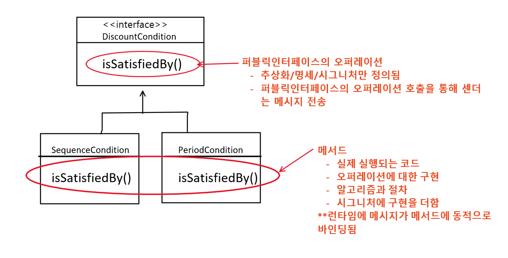

## 메시지와 인터페이스
---
- 메시지 : 객체가 다른 객체와 협력하기 위해 사용하는 의사소통 메커니즘
- 퍼블릭 인터페이스 : 외부에서 수신할 수 있는 메시지의 묶음
- 오퍼레이션 : 객체가 다른 객체에게 제공하는 추상적인 서비스
- 메시지 전송 : 객체의 오퍼레이션이 실행되도록 요청하는 것
- 메서드 : 메시지에 응답하기 위해 실행되는 실제 코드블록. 오퍼레이션의 실제 구현
- 시그니쳐 : 오퍼레이션이나 메서드의 명세 ex) 이름과 인자목록

 

## 퍼블릭 인터페이스의 오퍼레이션 vs 메서드
---
- 둘의 구분은 다형성의 개념과 연결됨

1. 메시지 센더(ex 클라이언트)가 **메시지를 전송**하면 
2. 런타임 시스템은 메시지 전송을 **오퍼레이션 호출**로 해석하고
3. 메시지 리시버(ex 서버) 객체의 실제 타입을 기반으로 적절한 **메서드**를 찾아 실행

 

## 퍼블릭 인터페이스의 품질에 영향을 미치는 원칙과 기법
---
- **디미터 법칙**
    - 객체의 내부구조에 강하게 결합되지 않도록 협력 경로를 **제한**하라
    - 낯선 자에게 말하지 말라
    - 오직 이웃에게만 말해라
    - 오직 하나의 도트(.)만 사용하라
        - instance.getOtherInstance().someMethod(); -> 디미터 법칙 위반 = **기차 충돌**
        - 기차 충돌
            - 연쇄적으로 메시지 전송
            - 클래스의 내부구현이 외부로 노출됨
            - 캡슐과 무너짐 / 내부구현 결합됨
        - 물론 모든 경우에 하나의 도트를 강제하는 규칙이 아님
        - 객체의 내부구현을 외부로 노출시키지 않는다면 ok
            - ex) IntStream.of(1,3,5).filter(x->x>3).distinct().count();
        
- 묻지말고 시켜라
    - 훌륭한 메시지는 객체의 상태를 묻지말고 원하는 것을 **시켜야**한다.
    - 행동을 요청하는 오퍼레이션을 만들어라
    
- 의도를 드러내는 인터페이스
    - 메서드 이름을 지을때, '어떻게'가 아니라 '무엇을'하는지 드러내라
    - **무엇을** : 객체가 협력 안에서 수행해야하는 **책임**이 무엇인지 고민하자
    - 수행방법이 아니라, 결과와 목적만을 포함하도록 이름을 지어라

 

## 참고 도서
---
오브젝트-코드로 이해하는 객체지향 설계 **6장 메시지와 인터페이스**