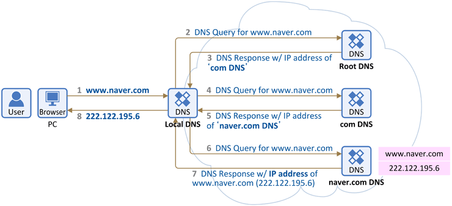

## DNS 의 기본적인 동작방식
---

 

 

1-1. 브라우저에서 www.naver.com을 입력한다.

1-2. 내 pc에 미리 할당되어있는 DNS서버(=local DNS서버)에게 "www.naver.com" hostname에 대한 IP주소를 찾아달라고 요청한다.

2 . local DNS에는 "www.naver.com" 에 대한 IP 주소가 있을 수도 없을 수도 있다.

- 2-1. 만약 있다면 Local DNS가 PC에 바로 IP 주소를 주고 끝
- 2-2. 없다면 미리 local DNS에 설정되어있던 Root DNS 서버에게 "www.naver.com"의 IP주소를 물어본다.
    - Root DNS 서버란?  
        
        전세계에 13대가 구축되어 있다. 우리나라의 경우 Root DNS 서버가 존재하지는 않지만 Root DNS 서버에 대한 미러 서버를 3대 운용하고 있다.

3 . Root DNS 서버는 "www.naver.com"의 IP주소를 모르기때문에 "com 도메인"을 관리하는 DNS 서버의 IP주소를 local DNS에게 전달해준다. 이 친구에게 물어봐~

4 . local DNS는 다시 "com 도메인"을 관리하는 DNS 서버에게 "www.naver.com"의 IP주소를 물어본다.

5 . "com 도메인"을 관리하는 DNS 서버에게도 주소가 없으므로 해당 DNS는 "naver.com 도메인"을 관리하는 DNS 서버의 IP주소를 local DNS에게 전달해준다. 이 친구에게 물어봐~

6 . local DNS는 다시 "naver.com 도메인"을 관리하는 DNS 서버에게 "www.naver.com"의 IP주소를 물어본다.

7 . "naver.com 도메인을 관리하는 DNS 서버"에는 "www.naver.com hostname에 대한 IP 주소"가 있다. 그래서 local DNS 서버에게 www.naver.com에 대한 IP 주소(  222.122.195.6) 를 전달해준다.

8 . 이를 수신한 Local DNS는 www.naver.com에 대한 IP 주소를 나중에 다시 물어보면 바로 응답할 수 있도록  캐싱하고 그 IP 주소 정보를 pc에 전달해준다.

- Local DNS 서버는 지금 **Recursive query**를 하고 있고,
- Root, Com, Naver.com DNS는  **Iterative query**를 하고 있다.

 

## 참고문서
---
<a href="https://www.netmanias.com/ko/post/blog/5353/dns/dns-basic-operation">DNS 기본 동작 설명 | NETMANIAS</a>