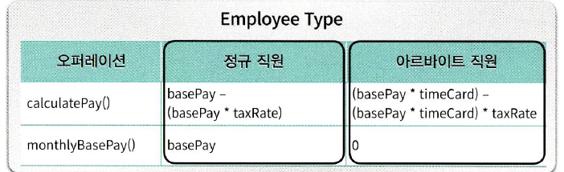
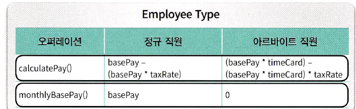

## 객체 분해
---
- 추상화 : 본질적인 정보만 남기고 불필요한 세부사항은 걸러내기
- 추상화의 가장 대표적인 방법 : 큰 문제를 작은 문제로 쪼개는 **분해**

## 01 프로시저 추상화와 데이터 추상화

- 시스템을 분해하는 추상화 메커니즘
    1. 프로시저 추상화
        - 무엇을 **해야하는지** 추상화
        - 기능분해=알고리즘분해 → 문제점에 대한 해결로 정보은닉/모듈화
    2. 데이터 추상화
        - 무엇을 **알아야하는지** 추상화
        - 추상데이터타입(Abstract Data Type) : 데이터 중심으로 **타입을 추상화**
        - 객체지향(Object-Oriented) : 데이터 중심으로 **프로시저를 추상화**
    - 프로그래밍 언어의 관점에서 **객체지향**이란 데이터를 중심으로 **데이터 추상화와 프로시저 추상화를 통합한 객체**를 이용해 시스템을 분해하는 방법
    - 객체지향이 전통적인 기능분해방법에 비해 효과적인 이유?

## 02 프로시저 추상화와 기능분해

- **메인함수로서의 시스템**
    - 시스템을 더 작게 분해될 수 있는 하나의 커다란 메인함수로 봄
    - 전통적인 하향식 기능분해 이용 → 최상위 기능을 수행하는데 필요한 절차들을 실행순서에 따라 나열함
    - 추상화 단위 = 프로시저
    - 하향식 접근법
    시스템을 구성하는 가장 **최상위 추상적인 기능**을 메인함수로 정의하고 → 메인함수를 **하위 기능으로 분해해** 나가는 방법
    각 하위 기능은 상위 기능보다 더 구체적+덜 추상적 이어야함

    

    - 전통적인 하향식 기능분해 가 가지는 문제점
        1. 시스템이 하나의 메인 기능이 존재하는 메인함수라는 비현실적인 아이디어
        2. 기능추가나 요구사항 변경으로 인한 메인함수의 빈번한 재설계 → 변경에 취약 / 확장 어려움
        3. 비즈니스 로직이 사용자 인터페이스와 강하게 결합됨
            - 비지니스 로직은 사용자인터페이스에 비해 변경이 적음
            - 사용자 인터페이스는 자주 변경됨
            - 하향식 접근법은 둘을 섞기 때문에 **변경에 불안정/관심사의 분리가 안됨**
        4. 너무 이른 시기에 **제어흐름의 결정이** 상위함수에서 이루어짐 →
        함수들의 실행 순서를 고정시키므로 **유연성과 재사용성이 저하됨**
        5. **결합도 높은 설계**
        상위 함수가 강요하는 문맥에 강하게 결합됨
        6. 어떤 데이터를 어떤 함수가 사용하는지 추적어려움 → 데이터 형식이 변경될 경우 예측할 수 없는 파급효과(=**데이터 변경에 취약**)
        → 테스트도 어려움
            - 데이터 변경으로 인한 영향을 최소화하려면?
            변경에 영향을 받는 부분과 받지 않는 부분을 **분리→**
            잘 정의된 퍼블릭 인터페이스를 통해 **변경되는 부분에 대한 접근을 통제하라**
            - 기능분해의 문제를 해결하기 위해 **정보은닉과 모듈** 개념 제시됨
    - 하향식 기능분해가 유용한 경우
        1. **이미 안정화된** 설계/**이미 해결된** 알고리즘을 문서화하기 용이
        2. 작은 프로그램과 개별 알고리즘을 위해서는 유용

## 03 모듈

- 기능 기반으로 분해하지말고 **변경의 정도/방향에** 맞춰 시스템을 모듈 단위로 분해하자!
- 모듈의 핵심은 데이터!
데이터를 중심으로 시스템을 분해하는 방법이다.
- **정보은닉**
    - 시스템을 모듈 단위로 분해하기 위한 기본 원리
    - 외부에 감춰야하는 비밀에 따라 시스템을 분할하는 모듈분할원리
    - 시스템에서 자주 변경되는 부분은 상대적으로 덜 변경되는 안정적인 인터페이스 뒤로 **감춰야함**
- 시스템을 모듈 단위로 어떻게 분해하나?
    - 시스템이 감춰야하는 비밀(**복잡성+변경가능성+데이터**)을 찾아서 방어막(=**퍼블릭 인터페이스**)으로 에워싸라
- 모듈의 장점
    1. 모듈 내부의 데이터가 변경되어도 파급효과를 제어할 수 있음 ↔ 하향식 기능 분해
    2. 비즈니스 로직과 사용자 인터페이스에 대한 관심사를 분리한다
    3. 전역변수와 전역함수를 제거함으로써 네임스페이스 오염을 방지(==이름 충돌의 위험 완화)
    4. 외부에 감출 비밀과 관련성 높은 데이터와 함수가 모임 ⇒ 모듈내부는 높은 응집도
    모듈 사이에는 퍼블릭 인터페이스를 통해 통신 ⇒ 낮은 결합도
- 모듈의 한계
    - 인스턴스 개념 제공 안함 → 인스턴스가 존재하는 추상화 메커니즘 필요함 → **추상 데이터 타입** 등장(데이터 중심으로 타입을 추상화)

## 04 데이터 추상화와 추상 데이터 타입

- 리스코프가 프로시저 추상화를 보안하기 위해 데이터 추상화 개념 제안
- **추상 데이터 타입**
    - 데이터 추상화를 기반으로 소프트웨어를 개발하게 한 최초의 발걸음
    - 타입추상화를 기반으로 하는 대표적인 기법
    - 시스템의 상태를 저장할 **데이터를 표현하는 목적 + 기능로직은 추상 데이터 타입 외부에 존재⇒ 한계:** 여전히 데이터와 기능을 분리해서 바라봄 → 절차적인 설계의 틀에 갇혀있음

## 05 클래스

- 데이터 추상화를 기반으로 시스템 분해
- 추상 데이터 타입 ≠ 클래스
- 클래스는 상속과 다형성 지원 ↔ 추상데이터타입은 지원x
클래스는 **데이터를 중심으로 절차(프로시저)를 추상화한** 것 ↔ 추상 데이터타입은 **데이터를 중심으로 타입을 추상화한** 것
- 객체지향은 타입을 기준으로 오퍼레이션/절차 묶음 ⇒ **다형성 실현 가능
객체가 메시지를 처리할 적절한 메서드를 선택**

- vs 
추상데이터타입은 **오퍼레이션/절차 기준**으로 타입을 묶음 (오퍼레이션안에서 조건문 if else 로 분기해서 타입에 따라 처리)

- 클래스 기반 OOP vs 추상데이터타입 기반 OBP(객체 기반 프로그래밍)
- 객체 지향에서는 타입 변수를 이용한 조건문을 **다형성으로 대체**
기존 코드에 영향없이 새로운 객체 유형을 추가할 수 있음 = OCP
변경하고 확장하기 쉬움
- 객체 지향 vs 추상데이터 타입 설계 언제 뭘 써야할까?

### 변경을 기준으로 선택해라

- '새로운 타입 추가'에 대한 변경 압력이 크다면 → **객체지향**
- '새로운 오퍼레이션 추가'에 대한 변경 압력이 크다면 → **추상데이터 타입 설계 OBP**

- **여전히 협력이 더 중요하다**
객체가 참여할 협력을 먼저 결정하고 → 책임을 수행하기 위해 어떤 객체가 필요한지 고민해라
- 타입계층과 다형성은 **협력이라는 문맥에서** 책임을 수행하는 방법에 대한 결과물이어야지 목적이어선 안된다.

 

## 참고도서
---
오브젝트-코드로 이해하는 객체지향 설계 **7장 객체분해**
