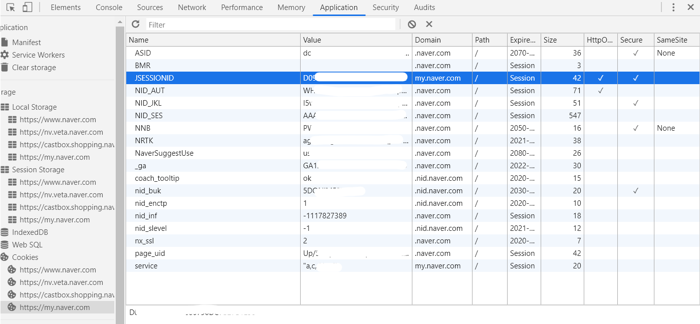

## 쿠키와 세션
---
### 쿠키(Cookie)

- 클라이언트(브라우저)에 저장되는 키와 값이 있는 작은 데이터 파일

- 이름, 값, 만료날짜(쿠키 저장기간), 경로 정보가 들어있다.

- 클라이언트의 상태 정보를 로컬에 저장했다가 참조한다.

- 클라이언트에 300개까지 쿠키저장 가능, 하나의 도메인당 20개의 값만 가질 수 있음, 하나의 쿠키값은 4KB까지 저장 가능

- 사용자가 따로 요청하지 않아도 브라우저가 Request시에 Request Header에 넣어서 자동으로 서버에 전송

- 로컬에 저장되기 때문에 변질되거나 request에서 스나이핑 당할 우려가 있어서 보안에 취약

- 라이프 사이클
    - 만료시간이 있지만 파일로 저장되기 때문에 **브라우저를 종료해도 계속해서 정보가 남아 있을 수 있다.**

- 쿠키에 정보가 있기 때문에 서버에 요청시 속도가 빠르다.

- **쿠키 프로세스**

1. 클라이언트가 페이지를 요청
2. 서버에서 쿠키를 생성해서 Response Header에 쿠키를 포함시켜 응답
3. 클라이언트가 요청한 웹페이지를 받으면서 쿠키를 클라이언트 로컬에 저장
4. 클라이언트가 재 요청시 웹페이지 요청과 함께 Request Header에 쿠키값도 전송
5. 서버에서 쿠키를 읽어 이전 상태 정보를 변경 할 필요가 있을 경우, 쿠키를 업데이트 하여 변경된 쿠키를 HTTP 헤더에 포함시켜 응답

- 쿠키 사용 사례
    - 자동로그인
    - 팝업에서 "오늘 더 이상 이 창을 보지 않음" 체크
    - 쇼핑몰의 장바구니

 

### 세션(Session)

- 일정 시간동안 같은 브라우저로 부터 들어오는 일련의 요구를 하나의 상태로 보고 그 상태를 유지하는 기술

- 세션은 **쿠키를 기반**하고 있지만, 사용자 정보 파일을 브라우저에 저장하는 쿠키와 달리 **세션은 서버 측에서 관리**한다.

- 서버에서는 클라이언트를 구분하기 위해 **세션 ID**를 부여하며 브라우저가 서버에 접속해서 브라우저를 종료할 때까지 인증상태를 유지한다.

- 사용자에 대한 정보를 서버에 두기 때문에 쿠키보다 **보안에 좋지만**, 사용자가 많아질수록 서버 **메모리를 많이 차지**하게 된다.

- 정보가 서버에 있기 때문에 처리가 요구되어 비교적 느린 속도를 낸다.

- 라이프사이클
    - 만료시간을 정할 수 있지만 **브라우저가 종료되면 만료시간에 상관없이 삭제**된다.

- **세션 프로세스**
    1. 클라이언트가 서버에 접속시 세션 ID를 발급받음
    2. 클라이언트는 세션 ID에 대해 쿠키를 사용해서 저장함 (쿠키 이름은 `JSESSIONID`)
    3. 클라이언트는 서버에 요청할 때, `JSESSIONID` 쿠키의 세션 ID를 서버에 전달한다.
        - 쿠키는 자동으로 서버에 전송되므로 서버에서 세션ID에 따른 처리를 할 수 있음
    4. 서버는 세션 ID를 전달 받아서 클라언트 정보를 가져온다.
    5. 서버는 세션 ID로 클라이언트를 구분해서 클라이언트의 요구에 맞는 서비스를 제공한다.

- 세션 사용 사례
    - 로그인 같이 보안상 중요한 작업을 수행할 때 사용

## 참고 자료
---
<a href="https://interconnection.tistory.com/74">https://interconnection.tistory.com/74</a> 

<a href="https://jeong-pro.tistory.com/80">https://jeong-pro.tistory.com/80</a>

<a href="https://victorydntmd.tistory.com/34">https://victorydntmd.tistory.com/34</a>

