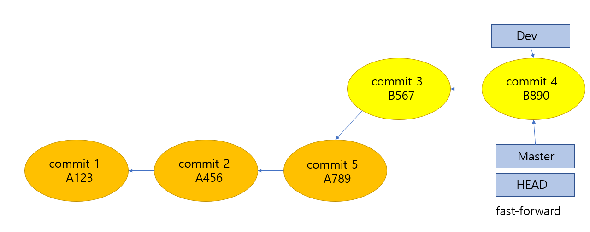

## 매번 헷갈리는 Git Merge vs Rebase

- rebase 듣기만 했지 브랜치를 합쳐야 할 때는 항상 merge 만 하고 괜히 충돌날까봐 써본적이 없었다. 사실 rebase와 merge가 어떤 차이인지 정확하게 몰랐다.

- 모르고 안쓰지말고 장단점과 차이를 정확하게 알고 상황에 맞게 선택해서 써보자.

### **Merge**

아래와 같은 커밋로그가 있다고 하자. 

커밋 옆에 붙은 숫자가 커밋이 생긴 순서이다.

해당 상황에서 `git merge dev` 를 통해 master branch에 dev branch를 merge 하면 checkout 된 master branch에 **새로운 merge commit**이 생긴다.

merge commit 이 생기면서 필요없는 commit object가 생기고, 이로 인해 로그가 지저분해 질 수 있다. 심하면 아래와 같은 상황이 발생할 수도 있다.

 

### **Rebase**

rebase란 단어 그대로 re-base. 

즉 branch의 base 를 다시 설정한다는 뜻으로 이해하면 쉬운 것 같다.

다시 처음 commit 상태로 돌아가본다.

dev branch를 master branch에 병합하기 위해서는 dev branch의 root commit이 `commit 2`에서 `commit 5`로 바뀌어야한다.

먼저, rebase는 dev branch의 base를 re 하는 것이므로 `git checkout dev` 로 체크아웃 해준다.

`git rebase master` 를 통해 dev branch에서 master를 rebase해주면,

위와 같이 dev branch의 base commit이 `commit 5`로 바뀐다. 중요한 건 리베이스 된 `commit 3`, `commit 4`의 **해쉬값도 바뀐다.**

이제 master branch에서 dev branch를 merge 해도
(`git checkout master`, `git merge dev`)

merge commit 이 생기지 않고, **dev branch에서 만든 commit 이력을 모두 포함**하는 fast forward merge가 가능하다.

 

### 언제 사용하는 것이 좋은가?

- Merge 장점
    - 이해하기 쉬움
    - 원래 브랜치의 컨텍스트를 유지함.
    - 브랜치 별로 커밋을 분리해 유지. 특히 이런 분리는 기능 브랜치에 유용.
    - **원래 브랜치의 커밋들은 변경되지 않고 계속 유지**되어 다른 개발자들의 작업과 공유되는 것에 대해 신경쓸 필요가 없음.

- Merge 단점
    - 커밋 히스토리상으로 불필요한 merge commit 이 쌓이므로 어지럽거나 깔끔한 이력관리가 어렵다.

- Rebase 장점
    - **단순한 히스토리**
    - 여러 개발자들이 같은 브랜치를 공유할 때 커밋을 합치는 가장 직관적이고 깔끔한 방법.
    - 여러 개발자들이 같은 브랜치를 공유할 때는 Pull & Rebase 가 히스토리를 깔끔하게 유지하는데 좋음.
    - **이 브랜치를 다른 곳에 푸시한 적 없는 경우**에 쓰면 좋다.
    - 푸시했다면 다른 사람이 이 브랜치를 체크아웃할 일이 없을 것이라 확신하는 경우.

- Rebase 단점
    - 충돌상황에서 다소 복잡. 커밋 순서대로 Rebase 를 하는데, 각 커밋마다 충돌해소를 순서대로 해주어야 한다.
    - rebase하면 commit 의 hash 값이 바뀐다.
    따라서 **해당 커밋들을 다른 곳에 푸시한 적이 있다면 히스토리를 다시쓰는 것에 부작용**이 발생. 
    - 만약 다른 사람이 그 브랜치를 체크아웃 받은 후 당신이 리베이스 한다면 꽤 혼란스럽게 될 것이다.

## 참고 자료

https://elegantcoder.com/git-merge-or-rebase/
https://brunch.co.kr/@anonymdevoo/7
https://cyberx.tistory.com/96
https://tech.10000lab.xyz/git/git-rebase-workflow.html