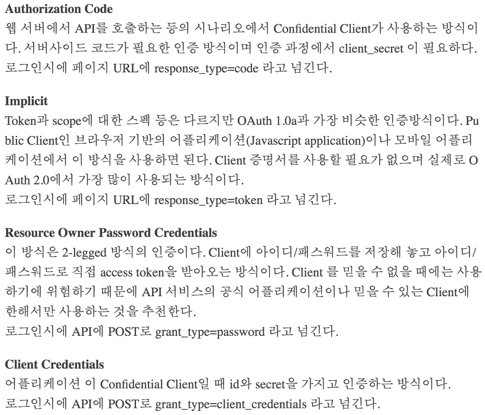
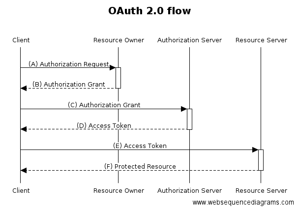

## OAuth 2.0

- OAuth 는 외부서비스의 **인증 및 권한부여**를 관리하는 범용적인 프로토콜

- OAuth를 사용하는 이유
    - 보안의 수준을 알 수 없는 애플리케이션에서 일일이 계정을 만들어 사용하면 ID/PW관리가 어렵고 
    - 개인정보가 유출되면 연쇄적으로 피해가 심각해질 수 있기 때문에 
    - 보안의 수준이 어느정도 검증된 사이트(OAuth provider(ex. google, facebook))의 API를 이용해서 인증을 받는 방법(OAuth)이 보안상 좋음

- 현재는 OAuth 2.0을 많이 사용함

- OAuth2.0 의 특징
    -  모바일 어플리케이션에서도 사용이 용이해짐
    - 반드시 HTTPS를 사용 -> 보안이 강화됨
    - Access Token 의 만료기간이 생김

- OAuth 2.0의 인증 방식 	
    1. **Authorization Code Grant** (가장 많이 쓰임)
    2. Implicit Grant
    3. Resource Owner Password Credentials Grant
    4. Client Credentials Grant

    

- OAuth 프로세스

    - Resource Owner : 일반 사용자. client의 서비스를 이용하는 사람, 이미 구글, 페이스북등에 가입된 사람으로 Resource server의 리소스 주인

    - Client : 우리가 관리하는 어플리케이션 서버
    
    - Authorization Server : 권한을 관리하는 서버. Access Token, Refresh Token을 발급, 재발급 해주는 역할을 한다.
    
    - Resource Server : OAuth2.0을 관리하는 서버(Google, Facebook, Naver 등) 의 자원을 관리하는 서버. Oauth 2.0 관리 서버의 자체 API

    

    A. Client가 Resource Owner에게 인증할 수단(ex Facebook, Google 로그인 url)을 보내면서 권한 요청을 한다.

    B. Resource Owner는 해당 Request를 통해 인증(로그인)을 진행하고 인증을 완료했다는 신호로 Authorization Grant를 실어 Client에게 보낸다.

    - Authorization Grant(권한 증서)는 Resource Owner가 자원에 접근할 수 있는 권한을 부여하였다는 확인증으로 Client가 access token 을 요청하여 얻어오는데 사용됨

    - `Authorization Code` 방식은 **Resource Owner가 Authorization Server에서 인증을 받고 권한을 허가함.** Resource Owner가 권한을 허가하게 되면 **Authorization Code**가 발급되고, 이 Authorization Code를 Client에게 전달하게 됩니다. Client는 이 코드를 Authorization Server에 보내주면서 자신이 권한 허가를 받았다는 사실을 알리고 access token을 받음.

    C. Client는 해당 권한증서(Authorization Grant)를 Authorization Server에 보낸다.

    D. 요청을 받은 Authorization Server는 Client가 보내온 권한 증서(Authorization Grant)의 유효성을 검증한다. 유효하다면 **access token, refesh token**을 발급해서 Client에 알려준다.

    E. access token을 받은 Client는 Resource Server에 자원을 요청할 수 있게 된다.

    F. Resource Server는 access token의 유효성을 검증하고 유효하다면 자원을 보내준다.

    - 만약 Access Token이 만료됐거나 위조되었다면, Client는 Authorization Server에 Refresh Token을 보내 Access Token을 재발급 받는다. 

    - 그 후 다시 Resource Server에 자원을 요청합니다.
    
    - 만약 Refresh token도 만료되었을 경우, Resource Owner는 새로운 Authorization Grant를 Client에게 넘겨야합니다. (=다시 사용자가 다시 로그인 해야한다.)

## 참고 자료

http://blog.weirdx.io/post/39955

https://tansfil.tistory.com/60

https://jeong-pro.tistory.com/99

https://interconnection.tistory.com/76