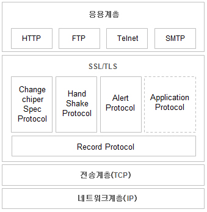

## HTTP

- hyper text transfer protocol
- world wide web 에서 하이퍼텍스트를 주고 받는 프로토콜
-  웹브라우저(Client)와 서버(Server)간의 웹페이지같은 자원을 주고 받을 때 쓰는 통신 규약
- 포트번호 80번
- 단순 텍스트를 주고 받기 때문에 누군가 네트워크에서 신호를 가로채어 본다면 내용이 노출되므로 보안상의 문제가 있음.
- 그래서 등장한 `HTTPS`

## HTTPS

- http over **Secure Socket Layer**
- http over **Trasport Layer Secure**
- http secure
- 포트번호 443
- 암호화된 통신을 제공하는 HTTP

- SSL(Secure Sockey Layer)란 보안 소켓 계층을 이르는 것으로, 인터넷 상에서 데이터를 안전하게 전송하기 위한 인터넷 암호화 통신 프로토콜을 말한다. SSL은 전자상거래 등의 보안을 위해 넷스케이프에서 처음 개발되었고, 시간이 지나 TLS(Transport Layer Security)로 표준화 하였다.

- 

- 응용계층의 HTTP 프로토콜에서 사용자의 데이터를 받고 전송계층으로 캡슐화되기 이전에 SSL 프로토콜에 의해서 사용자의 데이터가 암호화된다. 그리고 서버는 전송계층에서 세그먼트를 받아 SSL 계층에서 데이터를 복호화하여 응용계층까지 보낸다.

- HTTPS는 인터넷 상에서 정보를 암호화하는 SSL(Secure Socket Layer)프로토콜을 이용하여 웹브라우저(클라이언트)와 서버가 데이터를 주고 받는 통신 규약

- **공개키 암호화 방식**으로 hypertext를 암호화
- 공개키 암호화 방식

    

    - 서로 다른 키 2개가 존재하는데 이 두 개의 키는 서로 공개키로 암호화하면 반드시 개인키로만 복호화할 수 있고 개인키로 암호화하면 반드시 공개키로만 복호화할 수 있다.

    1. 암호화-공개키,복호화-비공개키 : 진짜 데이터를 암호화하여 보호하기 위한 목적이다.

    2. 암호화-비공개키,복호화-공개키 : 인증을 위한 목적이다. 즉, 서버에서 비공개키로 데이터를 암호화해서 보냈고 클라이언트에서 공개키로 복호화가 된다면 최소한 해당 서버는 클라이언트 입장에서 신뢰할 수 있다는 인증과정을 거치게 된다.

    - 장점
        - 공개키로 해독이 가능하다면 반드시 해당 서버의 개인키로 암호화했다는 것을 보장하기 때문에 해당 서버로부터 온 응답임을 확신할 수 있다.

 

## 참고자료

https://jeong-pro.tistory.com/89

https://coding-start.tistory.com/208